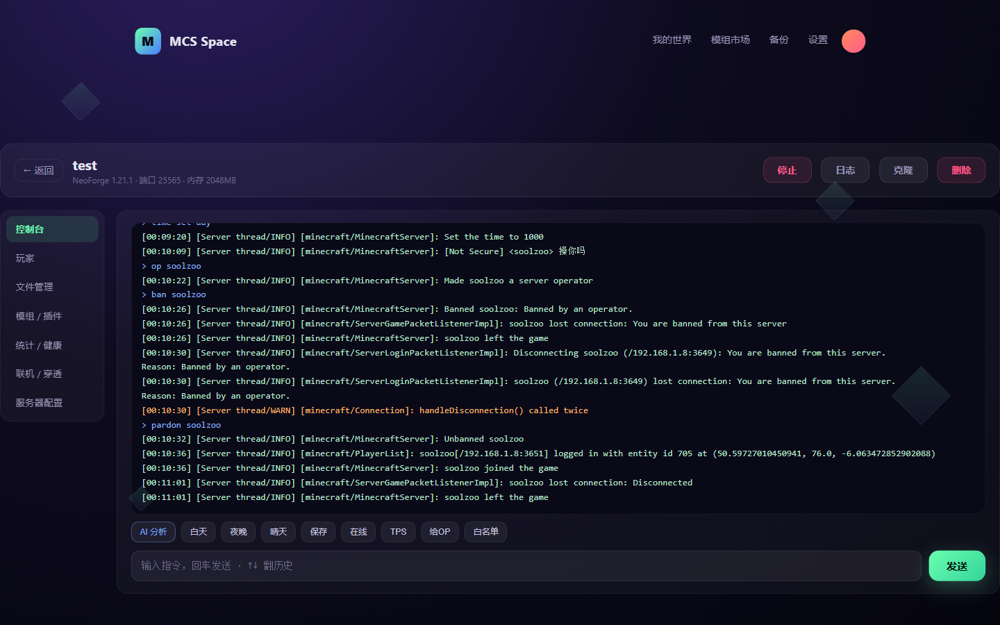
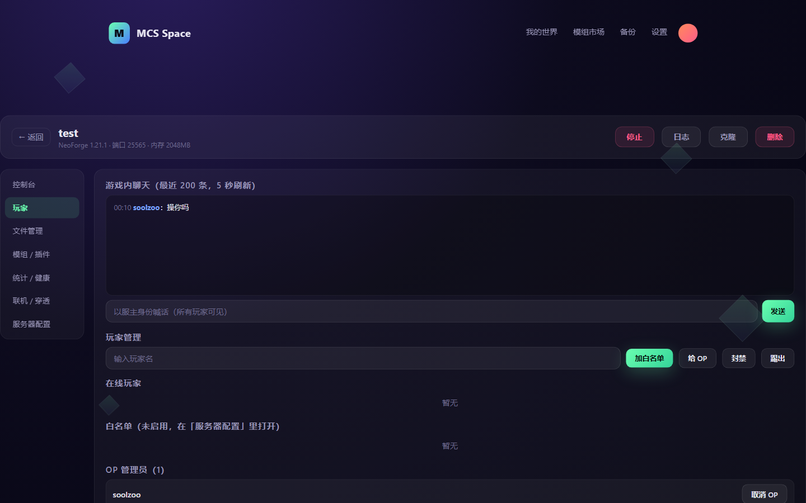
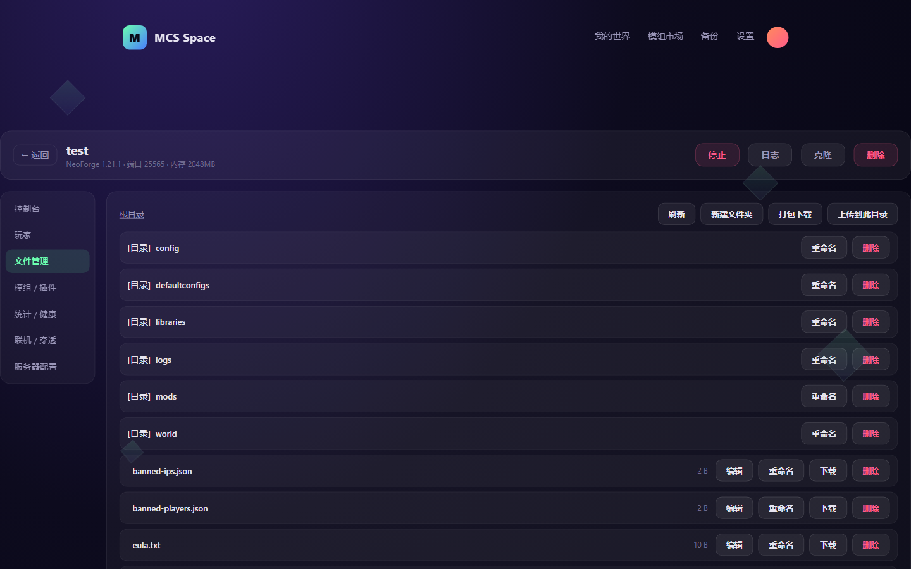
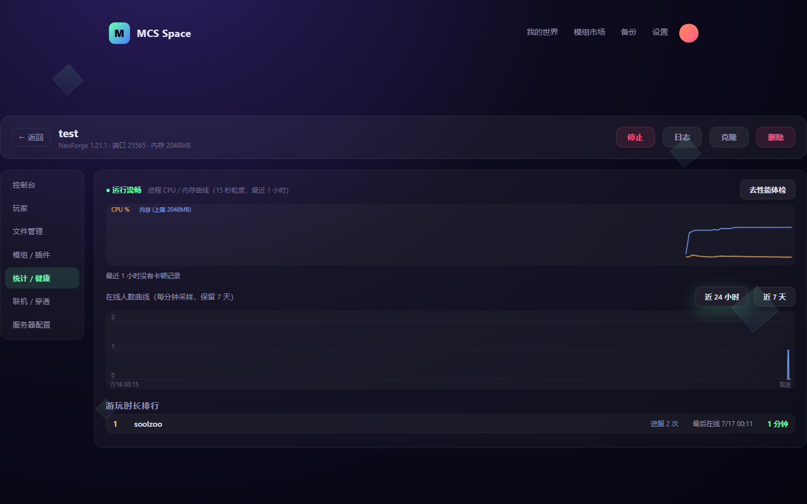
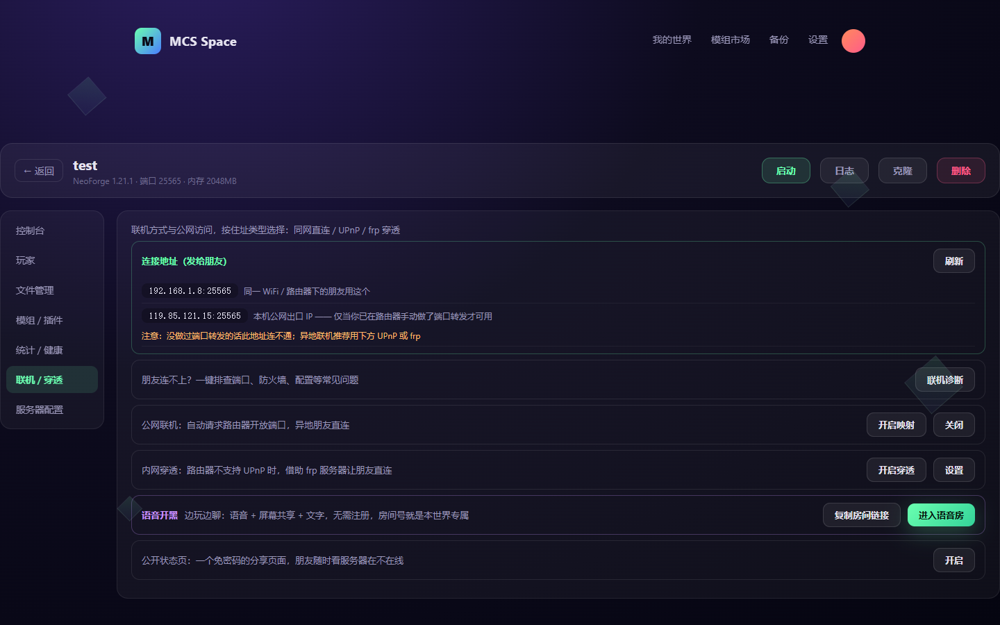

# MCS Panel

Windows 本地 Minecraft 开服面板。一个 exe,双击运行,浏览器打开 `127.0.0.1:8145` 就能用。

Go 编写,前端资源内嵌,单文件无运行时依赖。支持 Paper / Purpur / Fabric / Forge / NeoForge,以及 SteamCMD 等通用游戏服务端;Minecraft 1.7 至最新版本,Java 8/17/21/25 按需自动下载安装。


## 功能

### 创建 / 导入

填名字、选服务端和版本即可建服:自动下载核心、匹配安装 Java、同意 EULA。也支持导入已有服务器目录、单机存档、Modrinth / CurseForge 整合包(mrpack / zip)。


### 控制台

WebSocket 实时日志、历史命令、快捷指令。启动失败自动给出原因(Java 版本不匹配、内存不足、端口占用、EULA 等),能自动修的直接给修复按钮;也可接 AI 分析日志(OpenAI 兼容接口,默认 DeepSeek)。



### 玩家

在线玩家列表,一键 OP / 踢出 / 封禁 / 白名单(停服状态下也能改),游戏内聊天记录查看。



### 文件

在线浏览 / 编辑 / 重命名 / 上传下载 / zip 解压打包。



### 统计

在线人数曲线(24h / 7d)、玩家时长排行、TPS 监控、CPU 与内存历史、卡顿事件列表。



### 联机

- 地址中心:汇总局域网 / frp / UPnP / 公网地址,标出哪个能用、该把哪个发给朋友
- 联机诊断:端口、防火墙、server-ip 错绑、online-mode 等 7 项检查,一键修复
- 内置 frp 穿透(自建服务器 / 樱花frp)、UPnP 自动映射
- Geyser + Floodgate 一键安装,基岩版 / 手机玩家可进
- 公开状态页,链接发给朋友看服务器在线状态



### 模组

Modrinth 搜索安装,按实例的版本和加载器过滤,不兼容有红黄标提示;模组服可一键导出客户端整合包(mrpack / zip)给朋友装。


### 备份

手动 / 定时自动备份,可浏览 zip 内容做局部恢复;删除的服务器进回收站保留 7 天;支持 WebDAV 云盘上传;Paper 核心更新与跨版本升级(强制先备份)。


### 运维

- 崩溃自动重启(10 分钟 3 次熔断防死循环)、每日定时重启
- 空服自动休眠:无人 10 分钟停服但端口保持监听,有玩家连入自动唤醒
- 崩溃 / 频繁卡顿 / IP 变化邮件通知
- 定时指令、开机自启、面板访问密码


## 使用

1. 下载 `mcs-panel-gui.exe`(窗口版)或 `mcs-panel.exe`(server 版),放到任意文件夹
2. 双击运行。窗口版直接弹出面板窗口;server 版用浏览器打开 http://127.0.0.1:8145

两个版本功能一致:窗口版是独立窗口(WebView2,Win10 21H1+ 自带,缺失时回落到系统浏览器),关窗即退出;server 版是控制台程序,适合挂机和开机自启。

所有数据(服务器、Java、备份、配置)都在 exe 旁的 `data/` 目录,拷走整个文件夹即完成迁移。

命令行参数:

```
-port 8145        面板端口
-host 127.0.0.1   监听地址(0.0.0.0 开放局域网访问,请先设置面板密码)
-data <dir>       数据目录(默认 exe 旁 data/)
```

## 构建

```
build.bat
```

或手动:

```
go build -o mcs-panel.exe .
go build -tags webview -ldflags="-H windowsgui" -o mcs-panel-gui.exe .
```

无 CGO,Windows x64。

## HTTP API

面板全部功能都通过 HTTP API 实现,可以脚本调用,文档见 [docs/API.md](docs/API.md)。
